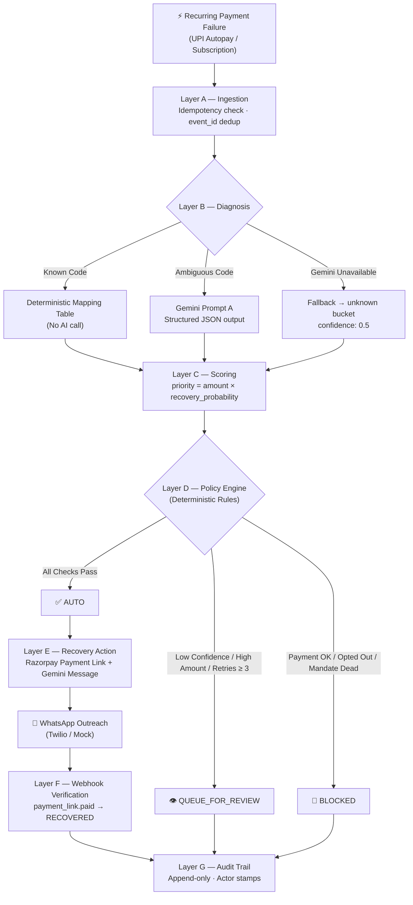

# RevGuard

> AI-powered recovery controller for failed recurring payments and UPI mandate auto-debits.

**Deadline**: 5 September 2026 | **Hackathon**: Razorpay BUILDATHON

---

## Problem Statement

Recurring payments fail. Banks time out, funds run low, mandates lapse. In fact, **over 40% of subscription churn is involuntary** — caused by technical glitches rather than customer intent to cancel.

- **For Businesses:** Each failure is silent revenue leakage. Most merchants lack an automated, safe system to recover it without expensive human call centers or spamming customers.
- **For Everyday Consumers:** Subscribers face abrupt service interruptions (e.g. EdTech access locked, health insurance lapsing, OTT suspended) followed by aggressive, robotic collection emails.

RevGuard is an intelligent recovery controller that monitors failed recurring debits, diagnoses the root cause, and automatically recovers safe cases via Razorpay Payment Links on WhatsApp while routing uncertain or high-value cases to a human review queue.

---

## Ecosystem Architecture & Real-World Data Sourcing

RevGuard is **B2B middleware** designed for merchants running recurring billing and UPI Autopay on Razorpay:

- **Where do we get failed payment data?**  
  Directly from Razorpay's Core Gateway via automated webhooks (`POST /api/v1/webhooks/razorpay` on events like `payment.failed`, `subscription.charged_failed`). The payload supplies transaction amount, exact failure code, attempt count, and subscription ID.
- **How do we get the customer's WhatsApp number?**  
  Captured during the customer's initial signup and mandate checkout on the merchant app. Razorpay's webhook delivers the customer's registered phone number (`contact` in E.164 format) alongside their explicit regulatory WhatsApp notification consent (`whatsapp_opt_in: true`).
- **How does RevGuard protect the everyday consumer?**
  1. **Zero Service Disruption:** Recovers failed debits before subscriptions get abruptly terminated.
  2. **Empathetic, Non-Aggressive Communication:** Generates polite, transparent messages in English, Hindi, or Hinglish on WhatsApp explaining *why* the auto-debit failed.
  3. **1-Click WhatsApp Resolution:** Delivers a secure Razorpay Payment Link for instant 10-second payment via Google Pay, PhonePe, or UPI.
  4. **Consumer Autonomy & Consent:** Replying `"STOP"` immediately blocks outreach and suppresses further charges.

👉 *Read the full [Business, Consumer & Data Architecture Guide](docs/business-and-data-architecture.md) for sequence diagrams and payload structures.*

---

## Architecture



### AI Judgment: Where Gemini Is Used

| Prompt | Purpose | What it may NOT do |
|---|---|---|
| A — Diagnose Failure | Classify ambiguous gateway messages | Override policy thresholds |
| B — Recovery Message | Generate customer-facing WhatsApp text (EN / HI / Hinglish) | Invent fees or deadlines |
| C — Reply Intent | Extract intent from customer replies | Trigger financial actions |

**Core thesis**: AI handles ambiguity; deterministic software handles financial correctness.

---

## Policy Engine

All thresholds are centralized in `backend/config.py`:

| Threshold | Default | Override |
|---|---|---|
| Min confidence for AUTO | 0.85 | `POLICY_MIN_CONFIDENCE_AUTO` |
| Max amount for AUTO | Rs.10,000 (1,000,000 paise) | `POLICY_MAX_AMOUNT_AUTO` |
| Max retries for AUTO | 3 | `POLICY_MAX_RETRY_AUTO` |

BLOCKED checks always run before QUEUE_FOR_REVIEW checks.

---

## Setup

### Prerequisites

- Python 3.11+
- Node.js 18+
- Firebase project with Firestore enabled
- Razorpay Test Mode account
- Gemini API key (Google AI Studio)

### Backend

```bash
cd backend
python -m venv venv
venv\Scripts\activate        # Windows
pip install -r requirements.txt

# Copy env file
copy ..\\.env.example ..\\.env
# Edit .env with your credentials

# Start backend
uvicorn backend.main:app --reload --port 8000
```

### Frontend

```bash
cd frontend
npm install
npm run dev
# → http://localhost:5173
```

### Dataset Generation

```bash
python data/generator.py --seed 42 --count 250 --out data/generated/v1.json
# Re-running with same seed produces identical output (reproducible)
```

### Evaluation

```bash
python evaluation/evaluate.py \
  --dataset data/generated/v1.json \
  --labels evaluation/labels.json \
  --out evaluation/results_v1.json \
  --firestore    # Optional: stores results to Firestore for Metrics screen
```

### Running Tests

```bash
cd backend
pytest tests/ -v

# Individual suites
pytest tests/test_policy.py       # All policy branches
pytest tests/test_diagnosis.py    # Deterministic routing + Gemini fallback
pytest tests/test_webhook.py      # payment_link.paid → RECOVERED
pytest tests/test_idempotency.py  # Duplicate prevention
```

---

## ngrok Setup (for Webhook Testing)

```bash
ngrok http 8000
# Copy the https URL → set as Razorpay webhook URL in Test Mode dashboard
# Webhook endpoint: https://<your-ngrok-id>.ngrok.io/api/v1/webhooks/razorpay
# Set RAZORPAY_WEBHOOK_SECRET in .env to match Razorpay dashboard setting
```

---

## API Reference

| Method | Endpoint | Purpose |
|---|---|---|
| GET | `/api/v1/dashboard/summary` | Live financial summary |
| GET | `/api/v1/cases` | List cases (filter by decision/status) |
| GET | `/api/v1/cases/{id}` | Case detail |
| POST | `/api/v1/events` | Ingest revenue event |
| POST | `/api/v1/events/seed` | Seed synthetic data |
| POST | `/api/v1/cases/{id}/recover` | Execute recovery |
| POST | `/api/v1/cases/{id}/approve` | Approve review case |
| POST | `/api/v1/cases/{id}/reject` | Reject review case |
| GET | `/api/v1/cases/{id}/audit` | Audit trail |
| GET | `/api/v1/cases/{id}/message` | Message preview |
| GET | `/api/v1/metrics` | Evaluation metrics |
| POST | `/api/v1/simulate/failure` | Demo failure injection |
| POST | `/api/v1/simulate/pitch-scenario` | 1-click judge demo sequence |
| POST | `/api/v1/webhooks/razorpay` | Razorpay webhook receiver |
| POST | `/api/v1/webhooks/twilio-reply` | Inbound WhatsApp reply handler |

Full interactive docs at: `http://localhost:8000/docs`

---

## Failure Recovery Story

See `docs/engineering-log.md` for day-by-day decisions.

Key engineering decisions:
- **Idempotency**: Every recovery action has a deterministic SHA-256 key. Double-clicking "Recover" is safe.
- **Webhook ambiguity**: We always return HTTP 200 to Razorpay — even for unknown payment links. Non-2xx causes Razorpay to retry and can trigger duplicate recoveries.
- **AI timeout**: If Gemini is unavailable, known codes still get deterministic diagnosis. Unknown codes go to QUEUE_FOR_REVIEW. The system never silently guesses.
- **Financial correctness**: Amounts are always integers in paise. Rupee display is only in the UI layer. Gemini never sees raw amounts and never makes financial decisions.

---

## Known Limitations

- Customer reply handling (Prompt C) requires an active Twilio WhatsApp inbox or equivalent.
- Evaluation accuracy depends on ground truth labels — ambiguous `unknown` bucket cases may be labeled conservatively.
- Firestore compound index on `provider_reference` must be created manually in the Firebase Console for webhook lookup.

---

## Future Scope

- Real-time webhook → dashboard push via Firebase Realtime listeners
- Twilio WhatsApp production integration
- Multi-merchant support with per-merchant policy overrides
- Retry scheduling for UNKNOWN action states
- A/B testing of recovery message templates
