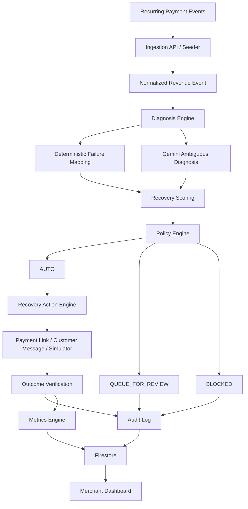
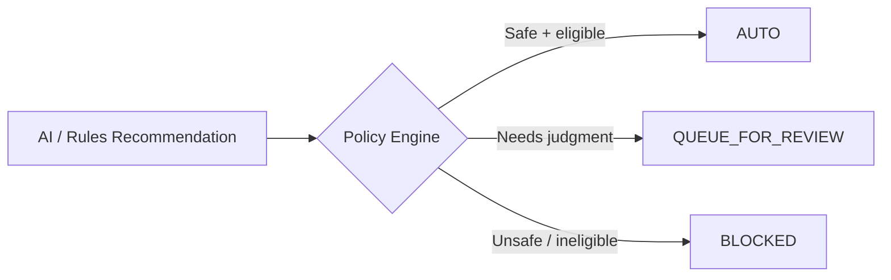

# RevGuard — Architecture

## 1. Architecture principle

Build a **modular monolith**, not microservices.

A solo developer has four days. The architecture must be clean enough to explain but simple enough to finish.



## 2. Recommended stack

### Frontend
- React
- Tailwind CSS
- Optional lightweight chart library only if already familiar

### Backend
Use the backend stack you can ship fastest.

Recommended:
- Python + FastAPI

Alternative:
- Node.js + Express

Do not change stacks midway.

### Persistence
- Firestore

Use Firestore for:
- recovery cases
- audit logs
- customer/subscription records
- generated recovery actions
- evaluation results

### AI
- Gemini API
- Structured JSON output / response schema

### Razorpay
- Test Mode
- Subscriptions APIs/webhooks where needed
- Payment Links for customer-initiated recovery
- Never use live credentials

### Messaging
- Twilio WhatsApp sandbox if reliable in your environment
- Otherwise a `MessagingProvider` abstraction with a deterministic demo/mock provider

## 3. Logical layers

### Layer A — Data ingestion

Responsibilities:
- accept synthetic or webhook-derived events
- validate schema
- normalize fields
- make event processing idempotent

Output:
`NormalizedRevenueEvent`

### Layer B — Diagnosis

First try deterministic classification.

Only unknown/ambiguous cases call Gemini.

Output:
`DiagnosisResult`

### Layer C — Recovery intelligence

Calculate:
- recoverability
- recovery probability
- priority score

Output:
`RecoveryRecommendation`

### Layer D — Policy

Policy engine is deterministic.

Output:
- AUTO
- QUEUE_FOR_REVIEW
- BLOCKED

### Layer E — Action

Possible MVP actions:
- generate recovery Payment Link
- send customer message
- create simulated retry/recovery outcome
- queue for human review

### Layer F — Verification

After an action:
- fetch/check current payment or payment-link state where supported
- handle uncertain outcomes
- never assume timeout == failure

### Layer G — Audit + metrics

Every material state transition is persisted.

## 4. Generic event shape

The internal event should remain generic:

```json
{
  "event_id": "evt_001",
  "revenue_type": "recurring_payment",
  "merchant_id": "m_001",
  "customer_id": "c_001",
  "amount": 2499,
  "currency": "INR",
  "status": "failed",
  "reason": "BANK_TIMEOUT",
  "attempt_count": 1,
  "occurred_at": "2026-09-01T10:00:00Z",
  "metadata": {}
}
```

This allows future expansion without claiming those modules are currently built.

## 5. Policy boundary



## 6. Idempotency design

Every externally meaningful action must have an `action_id`.

Recommended identity:

```text
action_id = hash(
  event_id +
  action_type +
  recovery_attempt_number
)
```

Before sending/executing:

1. Look for an existing successful/completed action with the same action identity.
2. Verify current payment/subscription state where applicable.
3. If state is unknown, verify before retrying.
4. Only then execute.
5. Persist action result.

## 7. Failure modes

The system must explicitly handle:

### AI timeout
Fallback:
- deterministic reason mapping if possible
- otherwise queue for review

### AI malformed output
Fallback:
- schema validation fails
- do not execute
- queue for review

### Razorpay API timeout
Fallback:
- mark `UNKNOWN`
- verify state before retrying
- use idempotency protection

### Duplicate event
Fallback:
- idempotent ingestion
- do not create duplicate recovery case

### Payment already succeeded
Fallback:
- BLOCKED
- no customer outreach

### Retry limit exceeded
Fallback:
- QUEUE_FOR_REVIEW

### Customer opted out
Fallback:
- BLOCKED
- no message

## 8. Deployment shape

```text
React frontend
      ↓
FastAPI backend
      ├── Diagnosis
      ├── Policy
      ├── Recovery
      ├── Audit
      └── Metrics
      ↓
Firestore
      ↓
Gemini API
      ↓
Razorpay Test APIs
      ↓
Optional Twilio sandbox
```

Do not deploy multiple backend services.

## 9. Manual owner actions for this phase

Before coding:
- Draw or approve the architecture.
- Confirm the backend framework.
- Confirm Firestore project.
- Confirm Razorpay Test Mode.
- Confirm Gemini API access.
- Choose live Twilio sandbox vs mock messaging.
- Create `.env.example`; never commit real secrets.
- Save the first version of the architecture diagram for the README.

During coding:
- Keep the architecture document synchronized with actual code.
- Record any architecture change in `docs/engineering-log.md`.

Before demo:
- Verify the deployed architecture works with test credentials.
- Prepare a local fallback if any external integration becomes unreliable.
