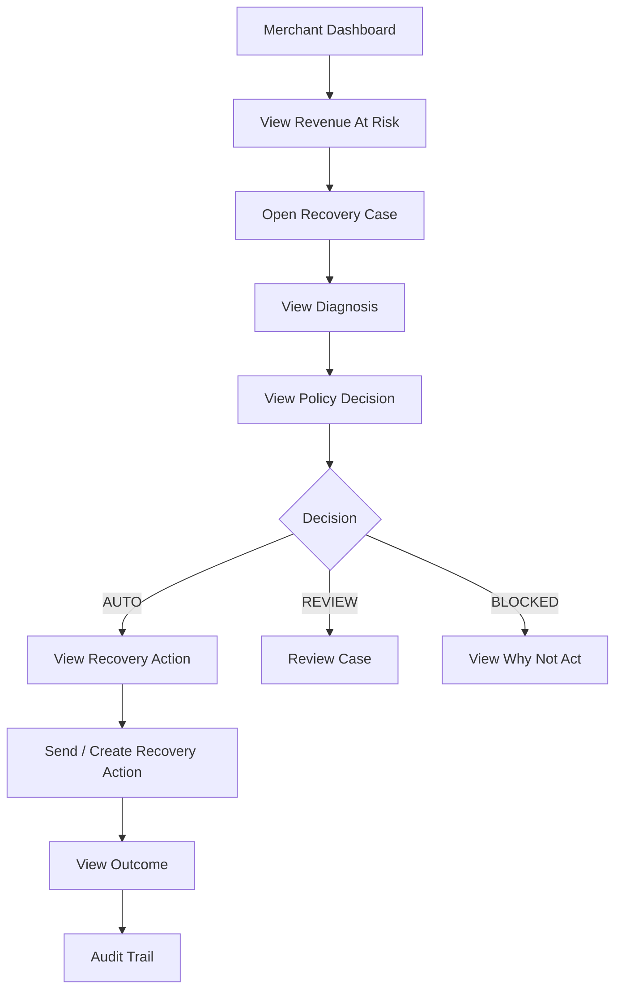
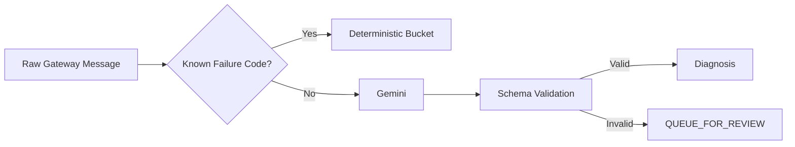
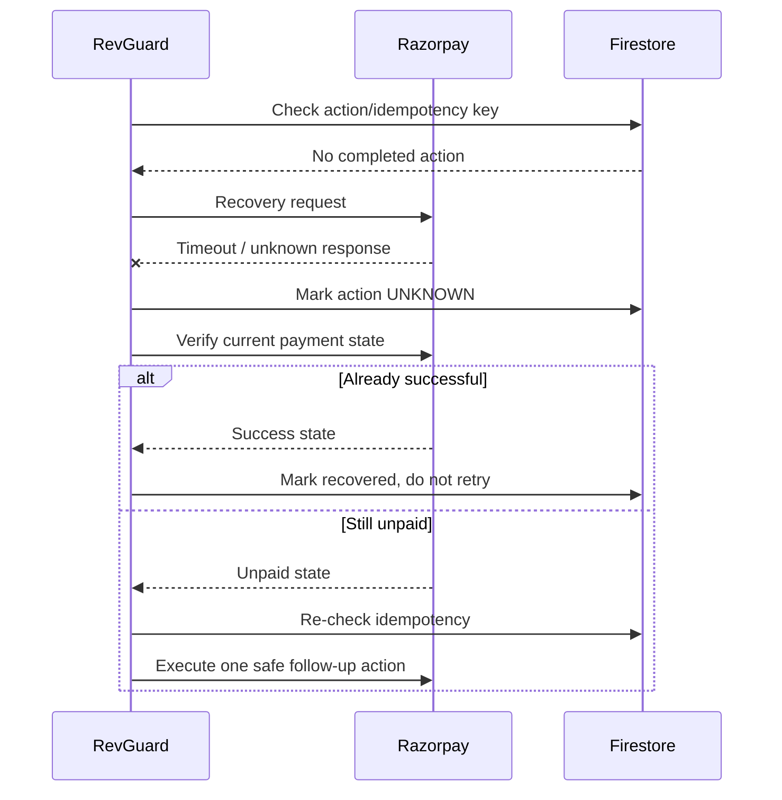

# RevGuard — User Flows

## 1. Primary merchant flow



## 2. Automated recovery flow

```text
1. Failed recurring payment arrives.
2. System validates the event.
3. Duplicate event check runs.
4. Deterministic failure mapping attempts classification.
5. If unknown, Gemini classifies the raw gateway message.
6. Recovery probability is calculated.
7. Policy engine evaluates eligibility.
8. If AUTO:
   - verify payment state
   - create/execute safe recovery action
   - generate customer message if required
9. Store action and audit records.
10. Verify outcome.
11. Update dashboard metrics.
```

## 3. Human-review flow

```text
Case detected
   ↓
Policy = QUEUE_FOR_REVIEW
   ↓
Merchant opens case
   ↓
Merchant sees:
- amount
- diagnosis
- confidence
- retry count
- customer history
- policy reason
   ↓
Approve / Reject
   ↓
If approved:
  controlled action
If rejected:
  close case
```

## 4. Blocked flow

Cases should be visibly blocked when:

- payment is already successful
- mandate is inactive/cancelled
- customer opted out
- action is non-recoverable
- the policy forbids further retry/contact

The UI must explain the block.

Example:

```text
BLOCKED

Reason:
Retry limit reached (3/3)

System action:
No additional customer message sent.

Why:
Repeated automated outreach could create customer friction
without sufficient recovery value.
```

## 5. AI ambiguity flow



## 6. Customer messaging flow

```text
Eligible case
   ↓
Recovery action chosen
   ↓
Gemini generates message
   ↓
Schema validation
   ↓
Policy/message safety check
   ↓
Messaging provider
   ↓
Delivery status
```

## 7. Customer reply flow

MVP reply intents:

```text
PAY_NOW
ASK_TO_DELAY
CONFUSED
STOP
OTHER
```

Example:

```text
Customer:
"kal kar dena"

Gemini:
{
  "intent": "ASK_TO_DELAY",
  "promised_date": "2026-09-02",
  "confidence": 0.94
}
```

The system must not invent dates or execute financial actions based only on a free-form reply.

## 8. Failure recovery flow



## 9. Manual owner actions for each flow

### Before building
- Verify every user flow corresponds to an actual backend endpoint.
- Mark every external API dependency.

### During testing
Manually execute:
1. Successful AUTO case.
2. BLOCKED case.
3. REVIEW case.
4. Ambiguous AI case.
5. Duplicate-event case.
6. Timeout/unknown-result case.

### Before recording
- Rehearse the exact golden path.
- Pre-create fallback demo data.
- Reset the demo database to a known state.

## 10. Dashboard landing flow (missing from earlier versions)

This is the first thing a merchant sees. It was implied but not explicitly documented.

```text
Merchant opens app
   ↓
Dashboard loads (GET /api/v1/dashboard/summary)
   ↓
Top metrics render: revenue at risk, recovered, rate
   ↓
Root cause breakdown renders (deterministic aggregation)
   ↓
Policy decision counts render (AUTO / REVIEW / BLOCKED)
   ↓
Recovery case table loads (GET /api/v1/cases?limit=50, sorted by priority_score desc)
   ↓
If QUEUE_FOR_REVIEW count > 0: badge/alert shown on Review Queue nav item
   ↓
Merchant picks their next action
```

**Gap this closes**: No file described the initial landing state or what the merchant sees *before* clicking any case. The review-queue badge is especially important for time-sensitive attention.

## 11. Customer payment-link journey (external, but must be considered)

RevGuard creates a Razorpay Payment Link and sends it. The customer's journey after that point matters for outcome verification.

```text
Customer receives WhatsApp/SMS message
   ↓
Customer clicks recovery link (Razorpay-hosted page)
   ↓
Customer pays (or abandons)
   ↓
Razorpay fires payment_link.paid webhook  ←── RevGuard must handle this
   ↓
RevGuard receives webhook:
   POST /api/v1/webhooks/razorpay
   ↓
Look up recovery case by provider_reference (plink_xxx)
   ↓
Mark recovery action SUCCESS
   ↓
Mark recovery case RECOVERED
   ↓
Write audit entry: PAYMENT_LINK_PAID
   ↓
Update dashboard metrics
```

**Gap this closes**: The webhook handler was listed in the API spec (section 15) but the end-to-end outcome-verification flow that *closes the loop* was never written out in user-flow terms. Without this, RECOVERED status would require manual intervention.

**Required**: The `payment_link.paid` (or equivalent) Razorpay webhook event must be mapped to a case lookup by `provider_reference`. This is the only automated path to marking a case RECOVERED without polling.

## 12. Dashboard metrics refresh flow

The dashboard shows real-time metrics. This flow documents how they stay accurate.

```text
Any of these events occur:
  - New failure event ingested
  - Case moves to RECOVERED
  - Case approved / rejected by merchant
  - Case blocked by policy
   ↓
Firestore document updated (case, audit_log, evaluation_run)
   ↓
Dashboard next load (or manual refresh) calls:
  GET /api/v1/dashboard/summary
   ↓
Summary is recalculated from current Firestore state
   ↓
Metrics reflect the real current state
```

**Gap this closes**: No file specified whether metrics are computed on-the-fly or from a cached evaluation_run. The recommendation is: compute on-the-fly from live Firestore case documents for the dashboard, and use evaluation_run only for the static Metrics screen (Screen 5). These are two distinct data sources and must not be confused.

**Rule to add**: The dashboard summary endpoint must NEVER return values from a hard-coded or stale evaluation_run document. It must query the live cases collection.
